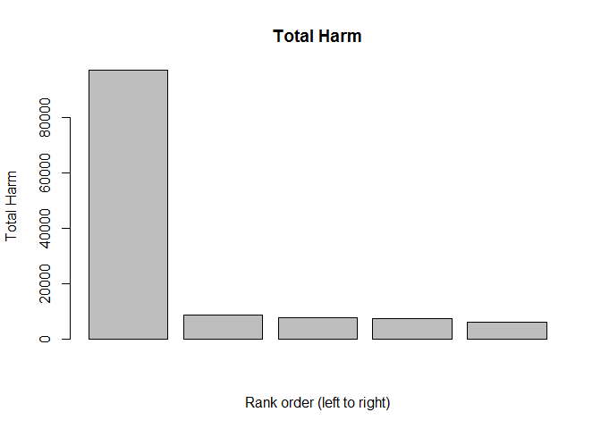

# U.S. Most Dangerous Storms
targonskimt  
Aug/2015  

#Synopsis
Through the exploration of U.S. National Oceanic and Atmospheric Administration's (NOAA) storm database, we have discovered Tornadoes are the most harmful type of storm to the population's health, while the Floods are the greatest economical consequences causing storm. The criteria to be classified as the most harmful storm is: the highest totals of fatalities and injuries caused throughout the times (1950-2011). The criteria to be classified as the greatest economical consequences causing storm is: the highest total property and crop damages throughout the times (1950-2011).


#Data Processing 
For this analysis, we will be using the U.S. National Oceanic and Atmospheric Administration's (NOAA) storm database. The tools we will use are: RStudio and knitr. 

Firstly, download the raw data and upload it.

```r
myStormDataRaw <- read.csv(bzfile("repdata_data_StormData.csv.bz2"))
```

###Data Clean Up
We notice our attribute EVTYPE which identifies the type of storm,is not consistent with naming convention. We will we will perform few simple data clean up techniques to give ourselves less unique storm types.

Make the desired fields to upper case to ensure aggregation and grouping works as expected. 

```r
myStormDataRaw$EVTYPE <- toupper(myStormDataRaw$EVTYPE)
myStormDataRaw$PROPDMGEXP <- toupper(myStormDataRaw$PROPDMGEXP)
myStormDataRaw$CROPDMGEXP <- toupper(myStormDataRaw$CROPDMGEXP)
```
Remove punctuations (ex: "(", "/", etc.) to increase the accuracy of grouping. 

```r
myStormDataRaw$EVTYPE <- gsub("[[:punct:]+]", "", myStormDataRaw$EVTYPE)
```

We will also convert PROPDMGEXP and CROPDMGEXP into their respective values. IE. B = 1,000,000,000; M = 1,000,000; K = 1,000; H = 100. This will allow us to combine this field with PROPDMG and CROPDMG to get the true values for damages. 

```r
myStormDataRaw$PROPDMGEXP <- gsub("B", 1000000000, myStormDataRaw$PROPDMGEXP)
myStormDataRaw$PROPDMGEXP <- gsub("M", 1000000, myStormDataRaw$PROPDMGEXP)
myStormDataRaw$PROPDMGEXP <- gsub("K", 1000, myStormDataRaw$PROPDMGEXP)
myStormDataRaw$PROPDMGEXP <- gsub("H", 100, myStormDataRaw$PROPDMGEXP)
myStormDataRaw$PROPDMGEXP <- as.numeric(myStormDataRaw$PROPDMGEXP)
```

```
## Warning: NAs introduced by coercion
```

Perform the changes as above for CROPDMGEXP. 

```r
myStormDataRaw$CROPDMGEXP <- gsub("B", 1000000000, myStormDataRaw$CROPDMGEXP)
myStormDataRaw$CROPDMGEXP <- gsub("M", 1000000, myStormDataRaw$CROPDMGEXP)
myStormDataRaw$CROPDMGEXP <- gsub("K", 1000, myStormDataRaw$CROPDMGEXP)
myStormDataRaw$CROPDMGEXP <- gsub("H", 100, myStormDataRaw$CROPDMGEXP)
myStormDataRaw$CROPDMGEXP <- as.numeric(myStormDataRaw$CROPDMGEXP)
```

```
## Warning: NAs introduced by coercion
```


## 1. The most harmful storm with respect to population health
In this analysis, the criteria to be classified as the most harmful storm is: the highest totals of fatalities and injuries caused throughout the times. 

Set myHarmfulStorm to be the total sum of fatalities and injuries caused by each type of storm.Sum the values, ignore NA values.

```r
myHarmfulStorm <- aggregate(list(TotalHarm = myStormDataRaw$FATALITIES + myStormDataRaw$INJURIES), list(Storm=myStormDataRaw$EVTYPE), FUN=sum, na.rm=TRUE)
```

Display top 5 in descending order (note: only care for the number one spot).

```r
head(myHarmfulStorm[order(-myHarmfulStorm$TotalHarm),],5)
```

```
##              Storm TotalHarm
## 739        TORNADO     96979
## 116 EXCESSIVE HEAT      8428
## 760      TSTM WIND      7461
## 153          FLOOD      7259
## 407      LIGHTNING      6047
```

For visual comparison to understand how much greater Tornado is compared to the next 4 most dangers storms.

```r
barplot(head(myHarmfulStorm[order(-myHarmfulStorm$TotalHarm),],5)$TotalHarm, main="Total Harm", xlab="Rank order (left to right)", ylab="Total Harm")
```

 


## 2. The greatest economical consequences causing storm
In this analysis, the criteria to be classified as the greatest economical consequences causing storm is: the highest total property and crop damages throughout the times.

Set myEcoCons to be the total sum of property and crop damages done by each type of storm. Multiple the PROPDMG with PROPDMGEXP to get real value, and multiple CROPDMG and CROPDMGEXP, sum values, ignore NA values.

```r
myEcoCons <- aggregate(list(TotalDamage = as.numeric(myStormDataRaw$PROPDMG*myStormDataRaw$PROPDMGEXP) + as.numeric(myStormDataRaw$CROPDMG*myStormDataRaw$CROPDMGEXP)), list(Storm = myStormDataRaw$EVTYPE), FUN=sum, na.rm=TRUE)
```

Display top 5 in descending order (note: only care for the number one spot).

```r
head(myEcoCons[order(-myEcoCons$TotalDamage),],5)
```

```
##                Storm  TotalDamage
## 153            FLOOD 138007444500
## 361 HURRICANETYPHOON  29348167800
## 739          TORNADO  16570326150
## 352        HURRICANE  12405268000
## 517      RIVER FLOOD  10108369000
```


#Results
Shown by the numbers of fatalities and injuries caused, Tornado is the most harmful storm that caused 96,979 fatalities and injuries. Through the numbers of property and crop damages, Flood is the most economical consequences causing storm that caused $138,007,444,500 property damage and crop damage. 
